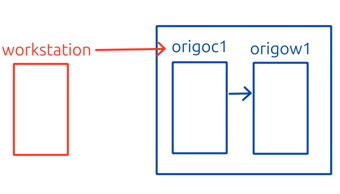
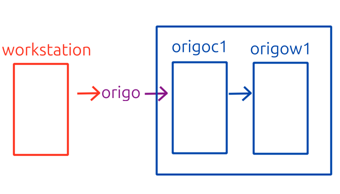
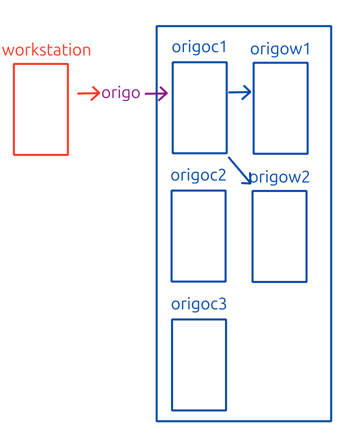
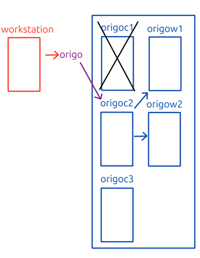

# Cluster Setup

There are many considerations that need to be taken and choices that need to be made when setting up a kubernetes cluster. This guide presents one set of solutions for these issues, and some of the reasoning behind them. However other choices and solutions are just as valid.

The first such choice is the kind or flavor of kubernetes you wish to run. Here we choose to configure a cluster using [`kubeadmn`](https://kubernetes.io/docs/reference/setup-tools/kubeadm/), a tool specifically developed for assisting in setting up a kubernetes cluster. In fact we will be more or less following the guide [Bootstrapping clusters with kubeadm](https://kubernetes.io/docs/setup/production-environment/tools/kubeadm/).

The reasoning for this is that using `kubeadm` for this task is not easy, and the reader will thus gain much knowledge and experience of many of the core concepts in kubernetes. The other reason is that this represents 15% to 25% of the CKA exam.

A simpler way to get access to a kubernetes cluster would be to run minikube, docker desktop kubernetes or a hosted cluster on a cloud service. And a much harder way would be to follow the guide [Kubernetes The Hard Way](https://github.com/kelseyhightower/kubernetes-the-hard-way).

Note also that this guide will purposely configure that next latest version of kubernetes. This is done such that we can practice upgrading a cluster, which is one of most important tasks of a kubernetes administrator.

## Nodes

At the most basic level a kubernetes cluster is a collections of computers that work together in an automated way to run containers. These computers are referred to as nodes. The nodes are generally grouped in two groups. 

* Control plane nodes administer the activities of the cluster. Normally these are configured not to execute any of the actual work containers.
* Worker nodes are in principal all the nodes that do not run any administration containers.

This guide will help you set up virtual machines you can use as your nodes. The absolute minimum you will need to be able to set aside for the vms is in total 4 CPUs and 4GB ram.

But actually any machine that meets the requirements stated here: [Before you begin](https://kubernetes.io/docs/setup/production-environment/tools/kubeadm/install-kubeadm/#before-you-begin), can be added to the cluster. Note however that one of the steps in the installation process is to deactivate swap on the machine. So if you use swap on a machine to increase performance, that machine might not be a good candidate.

Kubernetes 1.30 actually has partial compatibility with systems using swap, and hopefully swap will not be an issue in a release or two.

It is also worth noting that windows machines can be used as worker nodes. This guide wil not be covering that however. See [Windows in Kubernetes](https://kubernetes.io/docs/concepts/windows/) fro more information. 

See [Applience Template](appliancetemplate.md) for a guide on how to generate your own template file that you can use to quickly launce vms for your cluster.

## Naming

Before we get to setting up the virtual machines, let us take a moment to discuss the naming on said nodes and cluster. In an enterprise environment you will probably have a couple of clusters names as `prod`, `staging`, `test` and so on. But in a study situation you will probably be using a few clusters to test various aspects of kubernetes. And you might end up calling them `test`, `test01`, `test02` and so on. But if we also take the names of the nodes into consideration the naming might go slightly overboard with names like `test1c1`, `test1w1`, `test2c1`, `test2c2` and `test2w1`. It might thus a good idea to avoid numbers in the primary name of the cluster. One god idea could be to call it according to what you are testing, like `ingress`, `metrics` or `servicemesh`. Alternatively something neutral like a color, planet or city.

Another thing worth considering is the use of a dns name for accessing the cluster. 



The above diagram of a simple cluster named `origo` shows how the cluster is accessed from a workstation. Since the setup is so simple one could argue that the simplest way would be to just connect to the control plane node.



A better solution would be to utilize a dns name that pointed to the control plane node.

  

The benefit of this setup becomes apparent with slightly bigger clusters. Where we can utilize the extra abstraction level to increase availability.

## Control Plane Node

Once you have chosen a name for your cluster add `c1` or `cp01` or similar suffix to it to attain the name of the cluster's control plane node. We will be using the name `origo` for the cluster and `origoc1` for the control plane node. When you have chosen a name for the the control plane node, follow the steps in [Appliance Template - Launch](appliancetemplate.md#launch) to initialize it.

Now using your favorite terminal ssh into the control plane node.

```
ssh vm_user_name@origoc1
```
You need to find out the ip of the vm. Execute the command:
```
ip -br a
```
You will need to find the ip in the output. In the below example output the ip address we are looking for is highted in orange.
<pre>
lo               UNKNOWN        127.0.0.1/8 ::1/128 
enp0s3           UP             <span style="color:orange;font-weight:bold">192.168.1.46</span>/24 fd75:501:9bc1:0:a00:27ff:fe4a:741e/64 fe80::a00:27ff:fe4a:741e/64 
</pre>
Now that you have ip you can initialize the kubernetes cluster. Execute the initialization script:
```
kubernetesstudies/cluster_setup/init_k8s.sh
```
When asked for the cluster name and ip enter them. The script will take a while to run. When it is finished you can validate that the cluster is initialized by executing:
```
kubectl get nodes
```
Wich should output something like:
```
NAME      STATUS   ROLES           AGE    VERSION
origoc1   Ready    control-plane   2d6h   v1.30.3
```
If the status is not ready, just wait a minute or two and run the command again.
## Worker Node
Just like the control plane node add a suffix like `w1`, `wo01` or similar to the cluster name to attain the worker name node. We will be using `origow1`. Launch the worker vm like you did for the control plane vm and log ssh into it.
```
ssh vm_user_name@origow1
```
Run the join script:
```
kubernetesstudies/cluster_setup/join_k8s.sh
```
When the script is done the command `kubectl get nodes` will return
```
NAME      STATUS   ROLES           AGE    VERSION
origoc1   Ready    control-plane   2d7h   v1.30.3
origow1   Ready    <none>          2d6h   v1.30.3
```
## Simple Test
To do a simple test run a simple pod containing a web server:
```
kubectl run webtest --image=httpd
```
Check that it is running
```
kubectl get pods
```
You will se something like:
```
NAME      READY   STATUS    RESTARTS   AGE
webtest   1/1     Running   0          39s
```
Now lets expose the pod
```
kubectl expose pod webtest --port=80 --type=NodePort
```
View the services to find out the NodePort that was opened:
```
kubectl get service
```
The port you are looking for is highlighted in orange:
<pre>
NAME         TYPE        CLUSTER-IP    EXTERNAL-IP   PORT(S)        AGE
kubernetes   ClusterIP   10.96.0.1     <none>        443/TCP        2d7h
webtest      NodePort    10.104.45.3   <none>        80:<span style="color:orange;font-weight:bold">30261</span>/TCP   45s
</pre>
Run:
```
curl localhost:30261
```
You should get something like:
```
<html><body><h1>It works!</h1></body></html>
```
To cleanup after the test run
```
kubectl delete pod/webtest service/webtest
```
To end you study session logout of both ssh sessions by typing `exit` and pressing enter and right click the vms click "Stop" -> "Power Off".