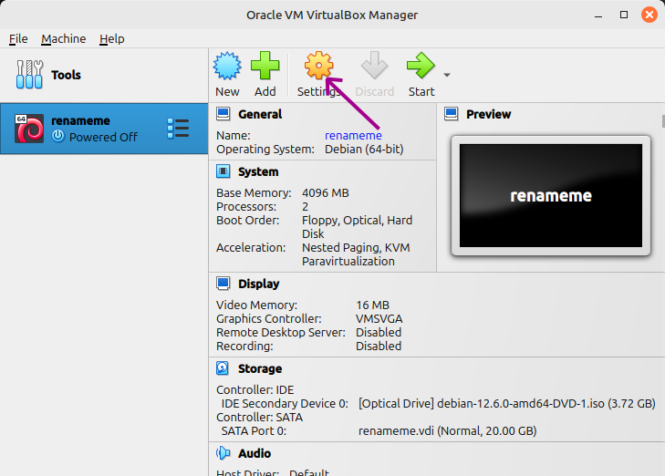
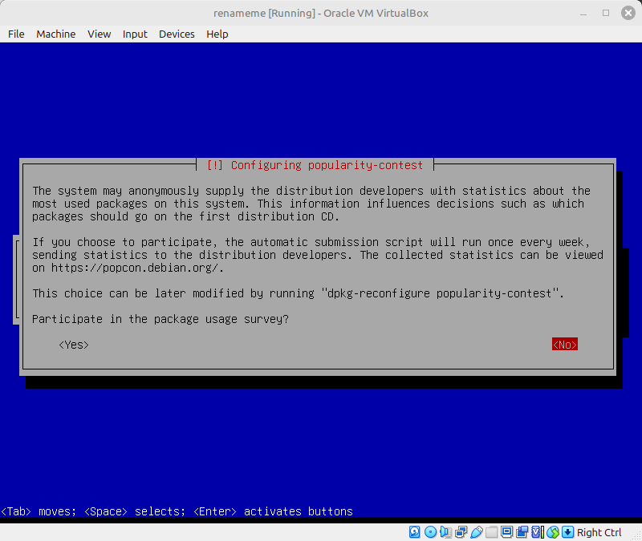

# Appliance Template

This document is a guide to creating a personal Oracle VN VirtualBox Appliance file that can be used to quickly launch Debian virtual machines. The specific appliance presented here is geared towards vms that can be used as nodes in a kubernetes cluster. However the general principal can be used to generate any kind of appliance template.

## Preparation

You will need Oracle VM VirtualBox installed and correctly configured on your system. Follow the specific guide on your for your host system here: [Download VirtualBox](https://www.virtualbox.org/wiki/Downloads).

Now we will need to download the iso file for the VirtualBox Guest Additions. Open VirtualBox and click "Help" -> "About VirtualBox..." and take note of the version of VB you are running. Find that version in this list: https://download.virtualbox.org/virtualbox/ , and download the VBoxGuestAdditions iso file from that folder.

You will also need Debian's lates netinstall iso. The link for the amd64 version is here [https://cdimage.debian.org/debian-cd/current/amd64/iso-cd/debian-12.6.0-amd64-netinst.iso](https://cdimage.debian.org/debian-cd/current/amd64/iso-cd/debian-12.6.0-amd64-netinst.iso). 

If you need an iso for another architecture start here: [https://cdimage.debian.org/debian-cd/current/](https://cdimage.debian.org/debian-cd/current/) then choose the folder for the architecture you need, then the iso-cd folder and then download the correct iso. You will probably need to read the specific documentations to choose the right iso. 

We will be connecting to the VM via ssh, specifically using ssh-key to identify ourself. If you do not have a ssk-key for your user on your host machine, open a terminal and generate one using the command:
```
ssh-key
```
Normally the default choices are fine. On windows the public key will be placed in a somewhere like `C:\Users\windows_your_username\.ssh\id_rsa.pub` and on linux it is placed in `~/.ssh/id_rsa.pub`. Note that the file might be named `id_ed25519.pub` or similar, depending on the algorithm used to generate it. Go look in your system and take note of the absolute path to your public key. 

## Installation

Open Oracle VM VirtualBox Manager and click "New".


Enter "renameme" in "Name", choose the iso file you downloaded in "ISO image", check "Skip Unattended Installation" and click "Next"


Increase "Base Memory" to 4096 "Processors" to 2, be sure "Enable EFI (special OSes only)" is not active and click "Next"


Click "Next"


Click "Finish"


Select the "renameme" VM and click "Settings"



Switch to the "Network" tab, choose "Bridged Adaptor" in "Attached to", in "Name" choose the primary network you use on the host machine, unfold "Advanced" validate that "Cable Connected" is active and click "OK"


---

**Note!!**

Before you continue you should be aware that when the VM window is open and you click in it, VirtualBox will popup with a message that it is about to capture/hijack your mouse. This is perfectly normal. However, it it a bit confusing as other things will be going on at the same tome. This is the popup that will be displayed:


I recommend accepting "Do not show this message again" and clicking "Capture" when this popup appears. Just remember that you can "Uncapture/Unhijack" your mouse by pressing **Right Ctrl**.

**Note!!**

The other thing that might confuse you when the VM window opens is the info pane to the right of the window.


This is where VirtualBox communicates with you with regards to this VM. It might say stuff like "Beware your mouse will be captured if you click here" or "Peripheral systems need configuring". These things are important and useful, but don't let them distract you the first time you start the VM, as there will be a counter counting down at the same time!

---

Select the "renameme" VM and click "Start".


When the vm screen opens you have 30 seconds to press "Arrow Down" before it starts talking to you aloud and confusing you even more.


Select "Install" and click enter


Select "English" for the installation.


Select your location. Mine is Denmark, so I will choose "other" and navigate to "Denmark".


Debian does not have an English culture for Denmark, so I gen a screen to choose another culture. I choose American English.


Choose the keyboard layout you are using.


Enter "renameme" in hostname


If you know the vm will be running in a specific lan, enter that lan's domain name here. Otherwise, leave this blank.


Don't enter a root password


Enter a name


Enter a username. This will become the administrator user on the virtual machines.


Enter Password. I recommend displaying the password so you are sure you can login to the vm.


This step is very important, as kubernetes nodes need to have swap disabled. Press "Down Arrow" until you can choose "Manual".


Choose the sda Harddisk


Choose "Yes"


Choose the "FREE SPACE"


Choose "Create a new Partition"


Accept the size and "Continue"


Choose "Primary"


Accept all the defaults and choose "Done setting up the partition"


You are done with this part. Choose "Finish partitioning and write changes to disk"


Debian will not like you not making a swap partition, and will try to get you to go back and make one. Don't let it do that. Choose "No".


Choose "Yes"


Let Debian do it's thing


We do not have any other volumes, so just choose "No"


Choose "Yes" to use a mirror repository.


Debian will guide you to find a mirror near you. Just follow its suggestions and find a good mirror site.


I don't know what to do here. I just leave it blank.


Work work.


If you want to participate in the survey then do so.



This is the other extremely important step. As this vm will be used as a kubernetes node we don't need any graphical stuff, but we do need to be able to access it via ssh.

The only things that should be active are "SSH Server" and "standard system utilities".


Wait for Debian to do it's thing


Choose "Yes" as we only have one OS on this VM.


Choose "/dev/sda"


Wait for Debian to finish the installation


When you continue now the window will close

A new VM window should start in a moment. If it is not doing so start it by clicking "Start"


The freshly installed Debian will open in a new window, but we wont be using that window. Just minimize it for now.


We will start by creating a `.ssh` directory inside the vm. From the host machine run:

```
ssh <vm_user_name>@renameme "mkdir -p /home/<vm_user_name>/.ssh"
```
Replace `<vm_user_name>` with the user name you chose above for the vm administrator. You will have to enter the password you chose in the installation process.

Now that the folder is in place, we will move the public key in place. You will need the location of your public key that you took note of in the preparation step.

Windows host machine:
```
scp X:\Path\to\public\key\file.pub <vm_user_name>@renameme:/home/<vm_user_name>/.ssh/authorized_keys
```

Linux host machine:
```
scp ~/.ssh/id_rsa.pub <vm_user_name>@renameme:/home/<vm_user_name>/.ssh/authorized_keys
```
Now you can login to the "renameme" vm with:
```
ssh <vm_user_name>@renameme
```
At this point we will add a renaming script to the virtual machine. 

Execute the below script:
```
cat <<EOF > renameme.sh
#!/bin/bash
read -p "Enter New Hostname: " newhostname
sudo sed -i -E "s/([[:digit:]]+\.[[:digit:]]+\.[[:digit:]]+\.[[:digit:]]+[[:blank:]]+)renameme/\1\$newhostname/g" /etc/hosts
echo \$newhostname | sudo tee /etc/hostname > /dev/null
sudo hostname \$newhostname
sudo shutdown -h now
EOF
chmod a+x renameme.sh
```
In some situations Debian will assume we are installing from a CD, and in a way we were doing that, but our cd was virtual. So we need to remove any reference to an installation CD from Debian's package management system. Run this command to achieve that:
```
sudo sed -i -e '/cdrom:/ s/^/#/' /etc/apt/sources.list
```

Now type `exit` and press enter to end the ssh session, and close the vm window you minimized earlier by clicking the x in the corner. When the dialog pops up choose "Power off the machine" and click "OK".


"Choose a disk file..."

Mount Guest Additions CD
```
sudo mount /dev/sr0 /media/cdrom0
```
Install prerequisites
```
sudo apt install dkms build-essential linux-headers-$(uname -r) -y
```

Install Guest Additions CD
```
sudo /media/cdrom0/VBoxLinuxAdditions.run
```
Unmount the CD
```
sudo umount /media/cdrom0
```
Create a mount point for the `kubernetesstudies` folder
```
mkdir kubernetesstudies
```
Add the vm user to the VBox sharing group
```
sudo usermod -aG vboxsf <vm_user_name>
```
```
```
```
```

While on the main window, be sure the "renameme" vm is selected, and press Ctrl+E to open the "Export Virtual Appliance" dialog.


Select "renameme" and click "Next"


In "File" choose where you want to save the appliance, in "MAC Address Policy" choose "Include all Network Adapter MAC addresses", uncheck "Include ISO image file" and click "Next".


Click "Finish"


Give it time to save...


When the appliance is saved we can remove the vm. Right click the "renameme" vm and choose "Remove..."


Click "Delete all Files"


That is it! You have created your own Appliance Template file, that you can use to quickly launce vms.

---

Now we will try to use the appliance file to make a fresh vm. In this example we will make a vm called **`origoc1`**, but you can use any name.

From the main window press Ctrl+I to open the "Import Virtual Appliance" dialog.


In "File" navigate to where you saved the `.ova` file from above and click "Next"


Double click the text "renameme" in front of "Name":


And enter the name of the new vm; `origoc1` in our case.


In "MAC Address Policy" choose "Generate new MAC addresses for all network adapters".

If you like you can change the new vm's memory and/or number of CPUs.

Click "Finish".


The new vm will load quickly


Now select the new vm and click "Start"


The vm's window will pop up. Login using the administrator credentials you used in the installation process.


The last step is to run the command

```
./renameme.sh
```

and type in the new vm's name again; `origoc1` in our case.


The script will finalize the renaming configuration and shut down the vm. 

To use the vm you can start it in headless mode by selecting the vm, clicking the little triangle beside the "Start" button and choosing "Headless Start"


Now you can connect to the new machine from your host system by using ssh in a terminal:

```
ssh vm_user_name@origoc1
```